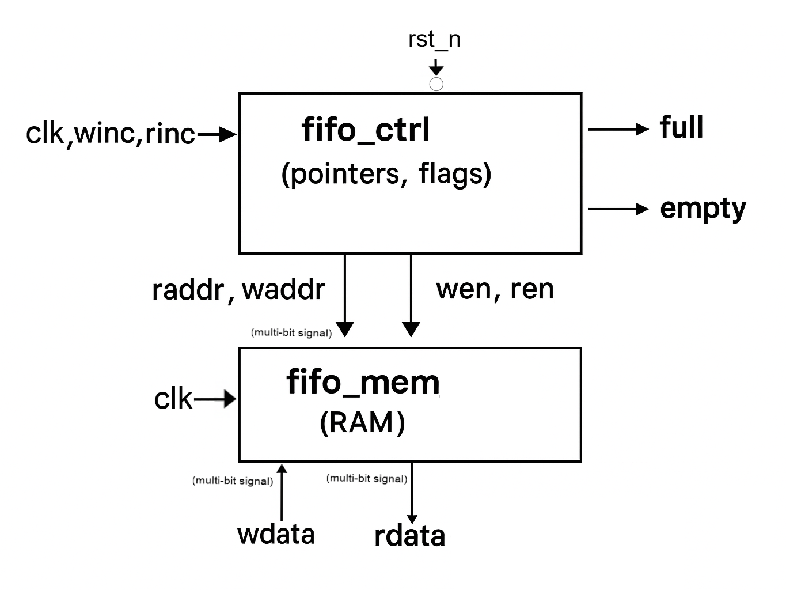

# Synchronous FIFO (Verilog) + Verilog/Python Self-Checking Testbenches

A configurable **synchronous FIFO** implemented in Verilog with a circular buffer and clean module boundaries (separate memory and control/pointer logic) plus **two self-checking testbenches**: one in Verilog and one in Python (cocotb-style).

---

## Highlights

- **Configurable sizes** via parameters:
  - `DSIZE`: number of bits per data word.
  - `ASIZE`: address bits; FIFO depth = `1 << ASIZE`.
- **Circular buffer design** with independent read/write pointers and an occupancy counter.
- **Synchronous** single-clock interface 
- **Safe overflow/underflow handling**: writes while `wfull` are ignored; reads while `rempty` are ignored.
- **Self-checking benches** compare the RTL against a behavioral FIFO *in the testbench* for easy waveform debugging.
- **Test coverage** includes:
  - Random write/read sequences
  - Write until **full**, then read out
  - Drain until **empty**
  - Overflow and underflow attempts

---

## Block Diagram



*Figure 1. High-level block diagram of the FIFO showing separated control (pointers/flags) and memory.*

## Example Waveform (EPWave)


*Figure 2. EPWave view of stimulus vs. FIFO outputs for a random traffic test.*


---


### What each file does

- **`fifo_sync.sv`**  
  The **top-level FIFO module**. Exposes the public interface:  
  - Inputs: `clk`, `rst_n`, `winc`, `rinc`, `wdata`  
  - Outputs: `rdata`, `wfull`, `rempty`  
  Internally wires up `fifo_ctrl_sync` (for pointers/flags) and `fifo_mem_sync` (for storage).

- **`fifo_ctrl_sync.sv`**  
  Implements synchronous **read/write pointer updates**, an **occupancy counter**, and **status flags**.  
  - `wfull` asserts when a write would overflow the depth.  
  - `rempty` asserts when no entries are stored.  
  - Write/read enables are masked when full/empty respectively to prevent overflow/underflow.

- **`fifo_mem_sync.sv`**  
  The **memory array** accessed with the current read/write pointers.  
  - One synchronous clock.  
  - Write on `winc && !wfull`.  
  - Read data is driven to `rdata` from the location indexed by the read pointer (registered or combinational based on your implementation).

- **`testbench.sv`**  
  A **Verilog self-checking testbench** that:  
  1) Drives sequences (random and directed),  
  2) Pushes/pops into a **behavioral FIFO model**  
  3) **Asserts** that RTL outputs match the model each cycle.  

- **`testbench.py`**  
  A **Python self-checking testbench** (intended for cocotb) that drives the same scenarios and compares against a Python **reference FIFO**.

- **`dump.vcd`**  
  A **waveform dump** generated by simulation runs. Regenerate by rerunning either testbench.


---

## Interface Summary (RTL)

| Signal      | Dir | Width         | Description                                    |
|-------------|-----|---------------|------------------------------------------------|
| `clk`       | In  | 1             | Synchronous clock                              |
| `rst_n`     | In  | 1             | Active-low synchronous reset                   |
| `winc`      | In  | 1             | Write request                                  |
| `rinc`      | In  | 1             | Read request                                   |
| `wdata`     | In  | `DSIZE`       | Write data                                     |
| `rdata`     | Out | `DSIZE`       | Read data                                      |
| `wfull`     | Out | 1             | FIFO cannot accept more data                   |
| `rempty`    | Out | 1             | FIFO contains no valid data                    |

> **Depth** = `1 << ASIZE`. On `wfull`, writes are ignored; on `rempty`, reads are ignored.

---

## Building & Running

> The examples below assume **Icarus Verilog** for the SV bench and **cocotb + Icarus/Verilator** for the Python bench. Adjust paths/tooling to match your environment.

### Verilog Testbench (Icarus Verilog)

```bash
# Compile (SystemVerilog 2012) and run
iverilog -g2012 -o tb   testbench.sv fifo_sync.sv fifo_ctrl_sync.sv fifo_mem_sync.sv && vvp tb

# Inspect the waveform
# This produces 'dump.vcd' which you can open with GTKWave or view in EPWave.

```

### Python Testbench (cocotb)

```bash
# Typical cocotb invocation (example). You may have a Makefile in your setup;
# if not, here is a minimal pattern that many cocotb templates follow.
# Environment prerequisites: Python 3.x, cocotb, a simulator (Icarus or Verilator).

# Example with Makefile-style variables (adjust TOPLEVEL/MODULE as needed):
make SIM=icarus TOPLEVEL=design MODULE=testbench

# Or, for Verilator-based flows:
make SIM=verilator TOPLEVEL=design MODULE=testbench
```

If your cocotb test creates a VCD/FSDB, open it in your preferred viewer (GTKWave / EPWave).

---

## Test Scenarios Implemented

1. **Random traffic**: write random values, then read them.
2. **Write‑until‑full**: push exactly `DEPTH` items; verify `wful`.  
3. **Drain‑until‑empty**: pop all items; verify `rempty`.
4. **Overflow attempt**: try to write with `wfull` asserted — data must be dropped and flags stable.  
5. **Underflow attempt**: try to read with `rempty` asserted — output must not change spuriously.

---